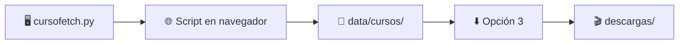

<div align="center">

# 🎓 CursoFetch

**Herramienta educativa para estudiar flujos HLS y automatizar descargas**  
*Investigación técnica sobre patrones de distribución de video en la web.*

<br>

[](https://www.python.org/)
[](https://ffmpeg.org/)
[]()
[]()
[]()

<br>

[Caso de estudio](#-caso-de-estudio) ·
[Inicio rápido](#-inicio-rápido) ·
[Características](#-características) ·
[Menú](#-menú-principal) ·
[Legal](#-aviso-legal)

---

> ⚠️ **Proyecto con fines de aprendizaje e investigación.**  
> No promueve piratería, redistribución ni elusión de DRM.

</div>

---

## 🔬 Caso de estudio

CursoFetch documenta un **patrón técnico muy repetido** en la web: plataformas que **reúnen cursos premium de alto valor** (formación, academias, infoproductos) y los **revenden sin licencia** del titular original, muchas veces inflando el precio.

Este repositorio **no va dirigido contra ninguna web concreta**. El ejemplo sirve para:

| Objetivo | Descripción |
|:--------:|-------------|
| 📚 **Aprender** | Cómo funcionan login + API (Supabase) + CDN (HLS/Bunny) + catálogos por slug |
| 🔍 **Investigar** | Debilidades habituales en la entrega de video vía streaming |
| 🛠️ **Automatizar** | Flujos reproducibles en un entorno controlado y con fines académicos |

> Cualquier similitud con sitios reales responde al **mismo stack técnico** (SPA + Supabase + `mediadelivery.net`), no a un ataque personalizado contra una marca.

**Importante:** usa la herramienta solo en contextos permitidos (contenido propio, laboratorio, permiso explícito). El código es genérico; la responsabilidad del uso es tuya.

---

## ✨ Características

<table>
<tr>
<td width="50%">

### 📦 Todo en uno
Un solo archivo — `cursofetch.py` — crea carpetas, dependencias y scripts al arrancar.

### 🌐 Extracción en navegador
Script JS + servidor local. El curso llega directo a `data/cursos/`.

### 📁 Organización automática
Carpetas por curso y módulo, igual que en el catálogo de origen.

</td>
<td width="50%">

### 🎬 Calidad inteligente
Detecta la mejor calidad HLS disponible (`best`) con **ffmpeg**.

### 🖥️ Interfaz clara
Menú interactivo en terminal con barras de progreso.

</td>
</tr>
</table>

---

## 🚀 Inicio rápido

### Paso 1 · Ejecutar

```bash
python cursofetch.py
```

> También puedes hacer **doble clic** en `cursofetch.py`.

Al primer arranque se crea todo solo:

```
📂 proyecto/
├── cursofetch.py      ← app principal
├── data/
│   ├── cursos/        ← biblioteca de cursos
│   └── import/        ← ZIP de respaldo
├── descargas/         ← videos MP4
└── assets/            ← scripts (generados)
```

### Paso 2 · Extraer curso (navegador)

| # | Acción |
|:-:|--------|
| 1 | Deja **CursoFetch abierto** (`http://127.0.0.1:18765`) |
| 2 | Inicia sesión en la **plataforma de ejemplo** y abre el catálogo |
| 3 | `F12` → **Consola** → pega `assets/scripts/extract_catalog.js` |
| 4 | El curso aparece en `data/cursos/` ✓ |

### Paso 3 · Descargar

```
Menú → Opción 3 → Elige curso → Calidad: best → Esperar
```



---

## 📋 Requisitos

| | Requisito | Detalle |
|:-:|-----------|---------|
| 🐍 | **Python 3.10+** | Recomendado 3.11 o superior |
| 🎬 | **ffmpeg** | `winget install Gyan.FFmpeg` · `choco install ffmpeg` |
| 🌍 | **Internet** | Para streams HLS |
| 🔑 | **Entorno de prueba** | Sesión válida en la plataforma que uses como ejemplo |

Las dependencias Python (`rich`, `colorama`) se instalan **automáticamente** la primera vez.

---

## 🎛️ Menú principal

| Opción | Descripción |
|:------:|-------------|
| **1** | Extraer UUIDs desde URL de catálogo |
| **2** | Extraer desde `catalogo.json` |
| **3** | 📥 Descargar curso desde biblioteca |
| **4** | Extraer + descargar (URL) |
| **5** | Abrir carpeta de descargas |
| **6** | Plataforma con login (caso de estudio / token) |
| **7** | Guía + contexto del ejemplo |
| **8** | Reintentar videos fallidos |
| **9** | Abrir carpetas del workspace |
| **0** | Salir |

---

## 💻 Línea de comandos

```bash
# Descargar un curso concreto
python cursofetch.py "data/cursos/Mi Curso/videos.json" -o descargas -w 1

# Slug en plataforma de ejemplo
python cursofetch.py --course-slug curso-demo --extract-only
```

---

## ⚖️ Aviso legal

<details>
<summary><strong>📜 Leer aviso legal y uso responsable (clic para expandir)</strong></summary>

<br>

Este repositorio se publica **únicamente con fines educativos y de investigación técnica** (HTTP, HLS, automatización, interfaces CLI, etc.).

- **No promovemos, facilitamos ni incitamos** el uso de esta herramienta para actividades ilegales, incluyendo descarga no autorizada, elusión de protecciones, redistribución de material ajeno o acceso sin permiso.
- **Eres el único responsable** de cómo utilizas el software y de cumplir las leyes aplicables y los **términos de servicio** de terceros.
- **Solo debes usarla** con contenido que puedas acceder de forma legítima (propio, licenciado o en laboratorio autorizado).
- Este proyecto **no está afiliado ni respaldado** por ninguna plataforma, CDN o proveedor cloud mencionado de forma genérica en el código.
- Los autores **no se hacen responsables** del mal uso que terceros hagan del código.

Si no estás seguro de si puedes descargar o conservar una copia de un contenido, **no lo hagas** y consulta a un profesional.

</details>

---

<div align="center">

### Disclaimer

Software **"tal cual"**, sin garantías.  
Patrón documentado con fines académicos — **no es un manifesto contra ningún sitio concreto**.

**No uses este proyecto para infringir derechos de autor ni términos de servicio.**

<br>

*CursoFetch v2.0.0 · Proyecto educativo · Hecho con Python*

</div>
